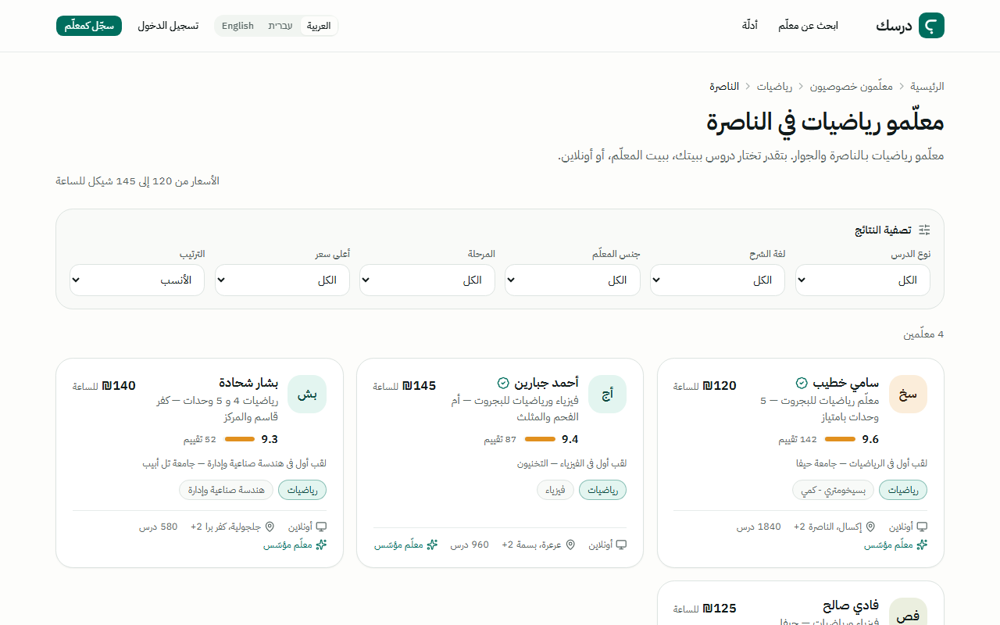
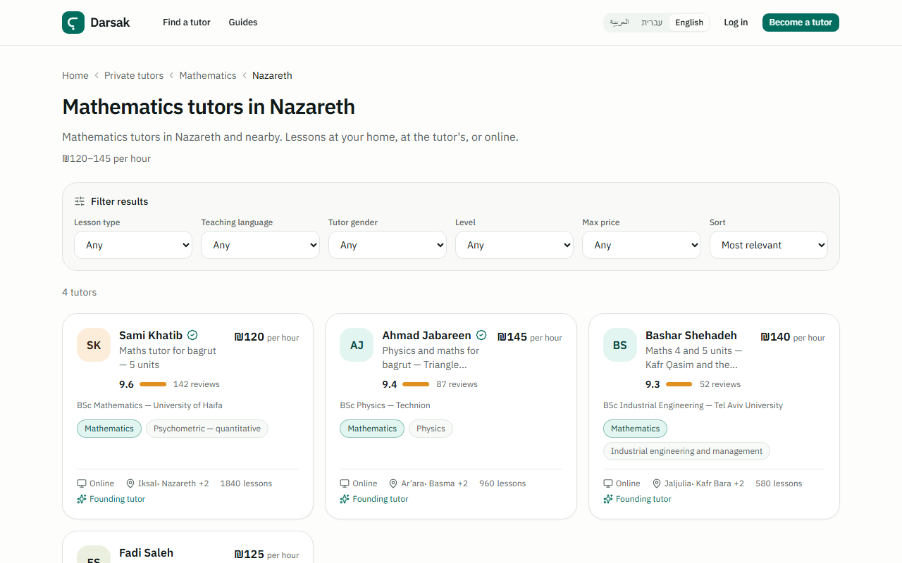

# Darsak

An Arabic-first marketplace for private tutors, built for Arab citizens of Israel. Arabic is the
default language, Hebrew and English sit beside it, and right-to-left is the default layout rather
than a mode.

**Status:** deployed on Vercel at **https://darsak-umber.vercel.app**. The directory and landing
pages are browsable, and the tutors on them are seeded demo data, not real supply. Phone sign-in
waits on an SMS provider; an email and password option sits beside it. Search indexing is closed on
purpose until the custom domain is attached (see below).

<p>
  
  
</p>

*The same landing page in Arabic and in English. Tutor names, ratings and lesson counts are demo data.*

## What's interesting in here

**Three locales, RTL by default, native-script URLs.** Every route lives under
[`app/[locale]/`](app/%5Blocale%5D), so there is no un-localised branch of the app. Paths are
translated per locale through next-intl ([i18n/routing.ts](i18n/routing.ts)), so the Arabic and
Hebrew URLs are in their own script, which is an SEO decision as much as a localisation one. An
ESLint rule flags physical direction utilities like `pl-4` ([eslint.config.mjs](eslint.config.mjs)),
because in an app that renders right to left first, those are defects rather than style.

**A build that stopped growing with the taxonomy.** The first Vercel build took 68 minutes. Every
subject and locality page asked the same "which pairs have tutors?" question three times, a
`group by` across a five-table join, about four thousand times per build. Those reads are now
memoised per process ([lib/data/supply-cache.ts](lib/data/supply-cache.ts)). Then the cross-product
itself: 114 subjects by 78 localities is a ceiling of 8,892 pages per locale, at 0.76 seconds a page
on the builder. So only the 150 deepest-supply pairs per locale are prerendered and the long tail
renders on first request ([lib/seo/prerender.ts](lib/seo/prerender.ts)), while the sitemap still
lists every page. Deploys take about 14 minutes now.

**Indexing that opens itself only when the supply is real.** [app/robots.ts](app/robots.ts) keeps
crawlers out until three things hold at once: a real database, a production deployment, and a host
that is not `*.vercel.app`. A directory of demo tutors would teach a search engine the wrong thing
about the site, and a preview URL settling in as canonical is expensive to unwind. Attaching the
custom domain is the switch, and nothing has to be remembered on launch day.

**Suites for the bugs that do not throw.** Each check script pins a failure that renders a page
instead of crashing:

| Script | What it pins |
|---|---|
| [check-search.ts](scripts/check-search.ts) | Arabic and Hebrew normalisation, so every native-script slug resolves back to exactly one subject or locality. Two real bugs shipped through here: one 404'd a town page, one served the wrong subject under a 200. |
| [check-messages.ts](scripts/check-messages.ts) | Locale parity across Arabic, Hebrew and English, comparing ICU placeholders and not just key presence |
| [check-scheduling.ts](scripts/check-scheduling.ts) | Israel wall-clock time to absolute instants on both sides of both daylight-saving transitions, where a naive offset silently moves half the year's lessons by an hour |
| [check-notifications.ts](scripts/check-notifications.ts) | Every notification kind rendered in every locale, links built for the recipient's locale, and coalescing |

One smaller decision worth a look: no phone number, tutor's or student's, is ever shown to the
other party. That is enforced at the data layer, not in the components: the
[`Counterpart`](lib/messaging/types.ts) type has no phone field, so a later change to a view cannot
leak one into the HTML.

## Stack

Next.js 16 (App Router), React 19, TypeScript, Tailwind CSS 4, shadcn/ui on Base UI, next-intl,
Drizzle ORM, Supabase (Postgres, Auth, row-level security), Zod, Web Push, Vercel. The functions and
the database both run in Frankfurt, because database round trips dominate the request and a
Supabase project's region is fixed when it is created ([vercel.ts](vercel.ts)).

## How it was built

I built Darsak solo over three days in August 2026, with Claude Code as a pair programmer, which is
why the commits carry a Claude co-author line. The architecture, the verification suites and the
product decisions are mine.

## Run locally

```bash
npm install
npm run dev          # http://localhost:3000, redirects to /ar
```

The directory runs on fixture data with no configuration at all, with a banner marking the demo
tutors as demo. Sign-in, onboarding and the dashboard need a database. A complete local stack, no
cloud account required:

```bash
npx supabase start                 # needs Docker running
cp .env.example .env.local         # fill in from `npx supabase status`

npm run db:migrate                 # Drizzle schema
npm run db:sql                     # search functions, RLS, constraints
npm run db:seed                    # taxonomy: 114 subjects, 78 localities
npm run db:seed:tutors             # optional: 28 demo tutors
npm run db:seed:availability       # optional: weekly calendars, so booking works
```

Sign in with `050-0000001`, `050-0000002` or `050-0000003` and code `123456`. These are fixed test
codes in `supabase/config.toml`, so no SMS provider is needed locally.

```bash
npm run check:search   # taxonomy slug round trip
npm run check:i18n     # locale parity across ar, he and en
npm run check:slots    # Israel-time slot maths across both DST transitions
npm run check:notify   # notification copy, links and coalescing
npm run typecheck && npm run lint && npm run build
```

## Layout

```
app/[locale]/       all routes; [locale]/layout.tsx is the root layout
i18n/               next-intl routing with localised pathnames
messages/           ar.json, he.json, en.json
components/         marketplace, messaging, scheduling, onboarding, site, ui (shadcn, RTL)
lib/
  taxonomy/         subjects and localities, the source of truth that seeds the database
  search/           Arabic and Hebrew normalisation and resolution
  data/             tutor repository: fixtures and Postgres behind one contract
  messaging/        inquiries, conversations, messages
  scheduling/       availability, slot generation, Israel-time conversion
  seo/              JSON-LD, hreflang alternates, landing-page stats, prerender budget
  auth/             session, phone normalisation, sign-in
  db/               Drizzle schema and client
supabase/sql/       search functions, RLS policies, messaging and notification triggers
scripts/            seeds and the check suites
docs/               architecture notes
```

The architecture notes are in [docs/04-tech-architecture.md](docs/04-tech-architecture.md), and the
coding conventions are in [AGENTS.md](AGENTS.md). The product plan is kept private.

## License

All rights reserved. See [LICENSE](LICENSE).
